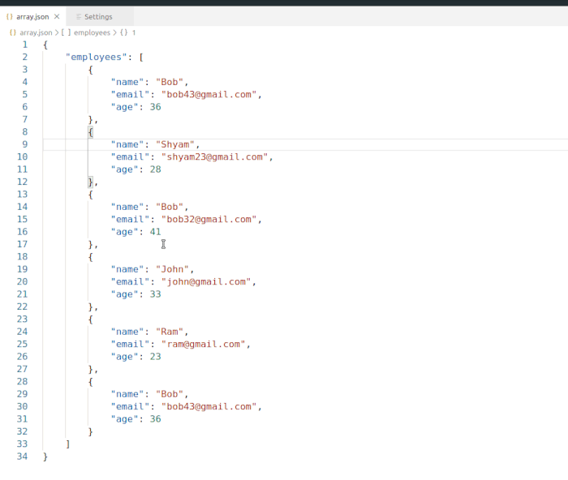
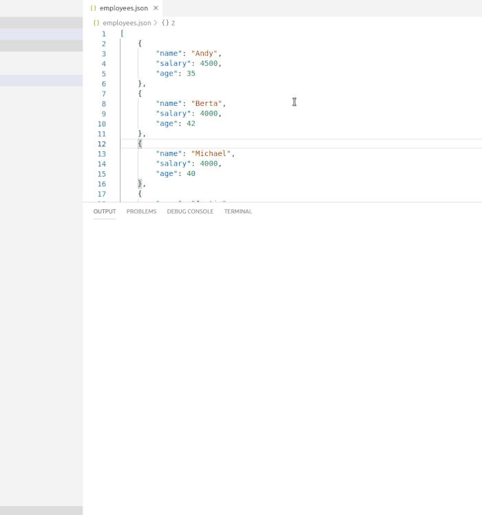

# Sort JSON array

Sorts a JSON array by common property or by custom function and replace the array in-place. The JSON array can be selected. If no selection is present, the extension will try to find an array that is enclosed by the current cursor position.

## Supported arrays and file type combinations

Definition of array types:
- loose JSON: Valid JSON array including starting (`[`) and closing (`]`) brackets. Furthermore, the parser can handle:
  - Single quoted properties. Unquoted properties are currently not supported
  - Dangling commas
- JSON lines format: Multiple lines each containing a valid JSON object. Selection of an arbitrary number of lines is supported

The following table shows which type of array is supported in which type of file. The table is applied top to bottom and the first match on the current file type will determine the supported array.

| File type    | Supported arrays | Auto-detect behaviour |
| ------------- |:-------------:|:-------------:|
| .jsonl      | JSON lines format | Whole file |
| any  | loose JSON      | Array enlosed by cursor |

## Demo

#### Sort array of objects ascending or descending by one or more properties to produce a deterministic sort result:  

#### Sort array using custom function:  

#### Manage sort modules:  

## Features
### Sort number, string or object arrays
String arrays are sorted using the lexicographic order. Number arrays are sorted based on their value. Objects are sorted based on one or more properties. The program will ask until the sort is deterministic. There is command for ascending and descending sort. Nested objects and arrays with mixed types are only supported by custom function. 

### Custom sort
Custom sort opens the sort module in another tab. The sort module must be a valid typescript module that exports a `sort(a, b): number` function. Typing of `a` and `b` can be arbitrary. Every time the module is saved, it will be evaluted and applied to the selected array. A preview of the sort function applied to the current array will be displayed in the output view. Any error in the sort module will be displayed as error message. When the sort module (= tab) is closed, it will be applied to the array of the file where the command was triggered. 

For older vscode versions: Opening the sort module in another tab only works properly if preview mode is disabled. Set `workbench.editor.enablePreview` to `false`. There is also some simple module management, including delete and rename functionality. New sort module will always be named `sort.xx.ts`.

Technical: Sort modules are stored in the global storage path location for this extension. This is a folder in your vs code config location.

### Selecting array manually
Selecting an array works well with the `editor.action.smartSelect.grow` keyboard shortcut or a simliar expand-selection shortcut.

If you wish to contribute, check out the [contributing guidelines](./CONTRIBUTING.md).